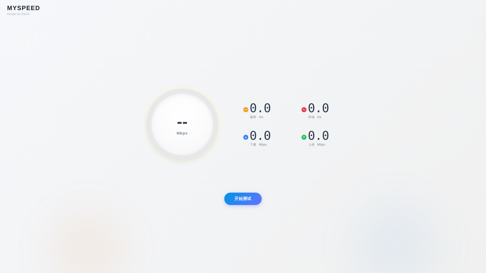
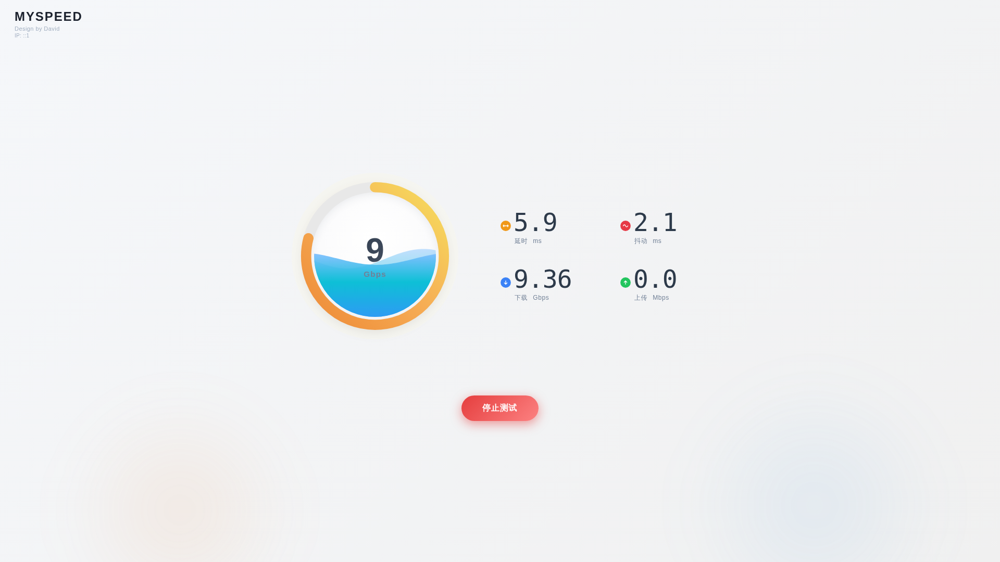
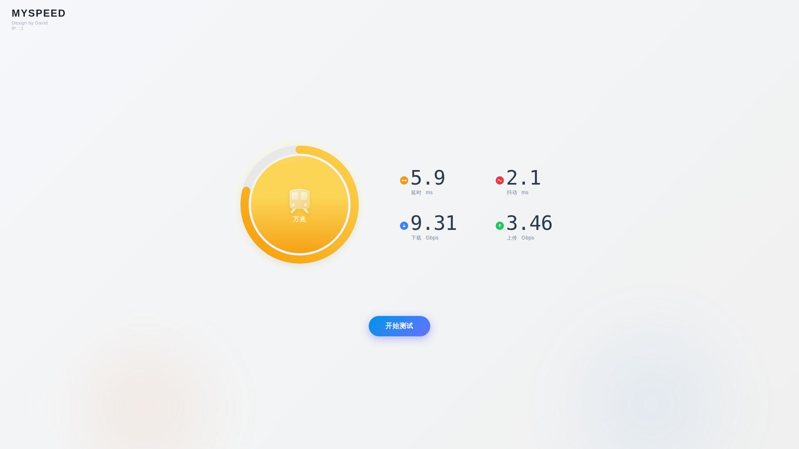

# MySpeed — 自部署网速测试

 *待机状态*  *测速中*  *测速完成*

自部署网速测试工具，测速引擎在 Web Worker 中运行，不阻塞主线程。Go 后端 + 原生 TypeScript 前端，编译为单二进制，嵌入全部静态文件，scratch 镜像约 5.5MB。

### 亮点

- **零框架前端**：原生 TypeScript + Vite，单页 DOM 节点高频更新，直接 DOM 操作比 Vue/React 更高效
- **Web Worker 测速引擎**：滑动窗口采样 + 变异系数（CV）稳定性检测，主线程不卡顿
- **速度表圆环**：对数刻度（10 Mbps → 0%, 25 Gbps → 100%），5 档等弧，测试中实时跟随速度
- **档位完成态**：测速完成后圆环中心显示对应档位图标 🐌🚲🚗🚄🚀，blob URL 预加载无延迟
- **SVG 波浪水槽**：正弦波闭合成水体，水位随测试进度实时上升，完成态变为琥珀色
- **单二进制部署**：Go embed 编译全部静态资源，Docker scratch 镜像仅 ~5.5MB
- **一键 Docker Compose 启动**，开箱即用

## 架构

```
backend-go/     Go 后端（测速端点 + 嵌入静态资源）
frontend/       原生 TS + Vite 前端（无框架，Web Worker 测速引擎）
```

- **后端**：Go + embed + net/http，goroutine 天然并发，单二进制部署
- **前端**：原生 TypeScript + Vite（无框架，单页 DOM 操作更高效）
- **测速引擎**：Web Worker + 滑动窗口采样 + 变异系数（CV）稳定性检测，主线程不阻塞
- **速度表**：对数刻度（10 Mbps → 0%, 25 Gbps → 100%），5 档等弧，测试中实时跟随速度
- **波浪水槽**：SVG 正弦波路径闭合成水体，两层波浪相位偏移叠加，水位 = 整体进度
- **完成态**：档位图标 + 琥珀渐变，圆环停在测到的档位刻度

> 选型理由：后端是 dumb pipe（吐数据/收数据/IP 查询），瓶颈在网络 I/O 不在 CPU，Go 比 Rust/Node 更适合且部署更干净；前端单页无路由、只更新少量节点，Vue/React 是 overkill。

## 快速启动

### Docker Compose

```bash
docker compose up -d --build
```

浏览器打开 `http://localhost:8090/`

### 直接运行

```bash
cd backend-go && go build -o myspeed .
PORT=8090 ./myspeed
```

浏览器打开 `http://localhost:8090/`

## API 端点

| 路径 | 方法 | 功能 |
|------|------|------|
| `/api/download?chunks=N` | GET | 流式吐随机数据，chunks 控制 MB 数（默认 4，上限 1024），用于下载测速 |
| `/api/upload` | POST | 接收 body 并丢弃，返回 200，用于上传测速 |
| `/api/ping` | GET | 返回极小响应体（`{}`），用于 RTT/抖动测量 |
| `/api/ipinfo?isp=true&distance=km` | GET | 返回客户端 IP + ISP 信息 JSON |

所有 API 端点支持 `?cors` 参数，传递时自动处理 CORS 预检和跨域头。
`/api/` 前缀与静态资源路径隔离，对反代友好（`location /api/` 一行分流）。

## 配置（环境变量）

| 变量 | 默认值 | 说明 |
|------|--------|------|
| `TITLE` | MySpeed | 页面标题 |
| `PORT` | 8090 | 监听端口（config.go 默认 8080，docker-compose 设为 8090） |
| `DISABLE_IPINFO` | false | true 时跳过 IP 信息查询 |
| `DISTANCE_UNIT` | km | 距离单位（km/mi） |
| `IPINFO_TOKEN` | — | ipinfo.io API token（公网部署可选） |
| `STATIC_DIR` | `../frontend/dist` | 开发模式静态文件目录（仅 embed 失败时回退，生产用 go:embed） |

## 开发

```bash
# 前端（frontend/）
pnpm install
pnpm build          # vite build → dist/
npx vitest run      # 单测（Sampler 速度计算 + StreamManager 流管理）

# 同步到 Go embed 目录
rm -rf backend-go/static/*
cp -r frontend/dist/* backend-go/static/

# 构建 Go 二进制（backend-go/）
/usr/local/go/bin/go build -ldflags="-s -w" -o myspeed .

# 启动
PORT=8090 ./myspeed
```

开发注意：系统默认 Go 可能为 1.19（太旧），需用 `/usr/local/go/bin/go`（1.22+）。每次前端改动后必须重建 Go 二进制（go:embed 将静态资源编译进二进制）。

## 测速参数

测速引擎参数（`frontend/src/engine/config.ts`）：

| 参数 | 默认值 | 说明 |
|------|--------|------|
| maxDownloadDuration | 16s | 下载测速上限 |
| maxUploadDuration | 16s | 上传测速上限 |
| warmupDuration | 1s | 预热期，不计入采样 |
| pingCount | 60 | 延迟测试 ping 次数 |
| stabilityWindow | 20 | 滑动窗口采样点数 |
| stabilityThreshold | 0.02 | 变异系数 ≤2% 自动早停 |
| downloadChunkMb | 200 | 单次下载请求大小 |
| uploadBlobMb | 40 | 单次上传数据块大小 |
| autoFinish | false | 固定时长，不自动早停 |
| downloadStreams | 6 | 下载并发流数 |
| uploadStreams | 3 | 上传并发流数 |
| overheadCompensation | 1.06 | TCP/IP 开销补偿系数 |

## 项目结构

```
MySpeed/
├── Dockerfile               # 多阶段构建（前端 → Go → scratch）
├── docker-compose.yml       # 一键部署（端口 8090）
├── backend-go/
│   ├── main.go              # HTTP 服务 + 静态资源分发 + gzip 压缩
│   ├── config.go            # 环境变量配置
│   ├── cors.go              # CORS 预检处理 & 跨域头
│   ├── handler_download.go  # 下载测速端点
│   ├── handler_upload.go    # 上传测速端点
│   ├── handler_ping.go      # 延迟/抖动测速端点
│   ├── handler_ipinfo.go    # IP 信息查询
│   ├── iputil.go / geo.go   # IP 工具与距离计算
│   └── static/              # go:embed 前端构建产物
└── frontend/
    ├── index.html           # 单页入口（SVG 波浪渐变定义）
    ├── src/
    │   ├── styles/main.css  # 全局样式 + CSS 变量
    │   ├── ui/main.ts       # 页面交互逻辑
    │   ├── ui/dom.ts        # DOM 引用
    │   ├── ui/ring.ts       # 圆环速度表 + 档位图标预加载
    │   ├── ui/wave.ts       # SVG 正弦波水面动效（相位归约防溢出）
    │   ├── ui/tier.ts       # 档位检测
    │   ├── ui/format.ts     # 数值格式化
    │   ├── engine/worker.ts # Web Worker 测速引擎
    │   ├── engine/engine.ts # 测速引擎入口（UI 对外的 API）
    │   ├── engine/sampler.ts# 滑动窗口采样器
    │   ├── engine/sequencer.ts # 测速阶段编排（延迟→下载→上传）
    │   ├── engine/stream-manager.ts # 并发 HTTP 流管理
    │   ├── engine/config.ts # 测速参数
    │   ├── engine/types.ts  # 共享类型定义
    │   ├── engine/progress.ts # 共享进度估算（抽离自 download/upload）
    │   └── engine/tests/    # Vitest 单测
    └── public/icons/        # 档位图标
```

## 安全检查清单

| 检查项 | 状态 |
|-------|------|
| TypeScript 严格模式编译 | ✅ 零错误 |
| Vitest 单元测试 | ✅ 16/16 通过 |
| Go vet 静态分析 | ✅ 通过 |
| Go 构建 | ✅ 通过 |
| CORS OPTIONS 预检 | ✅ 已处理（`cors.go`） |
| Content-Security-Policy | ✅ 已设置 |
| 路径穿越防护 | ✅ 无文件操作（纯 API） |
| XSS 向量 | ✅ 无用户输入渲染 |
| 时序竞态（共享可变状态） | ✅ 无 |
| 未捕获的 Promise 拒绝 | ✅ 所有 fetch/async 有 try-catch |
| 测速引擎并发安全 | ✅ 只读缓冲区 |
| 快速双击开始/停止 | ✅ `sequenceGen` 机制防止竞态 |
| 浏览器标签页隐藏时测速 | ✅ Worker 线程不受影响 |